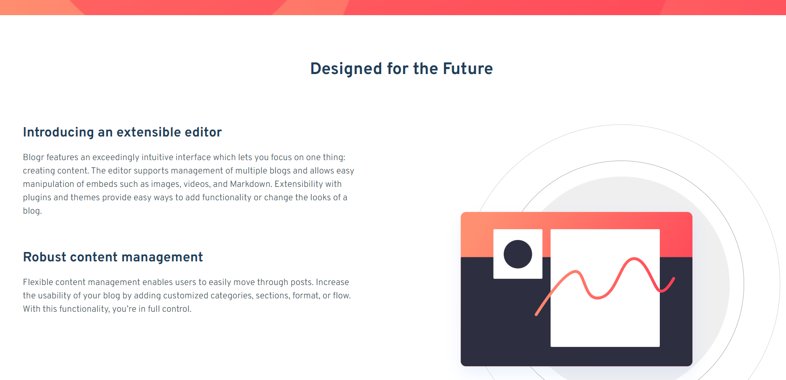
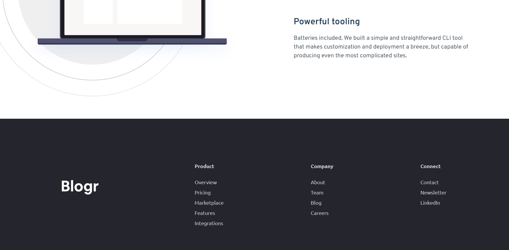

# Blogr Landing Page Website Laura Dev

This project involved working on a solo project Blogr landing page with Typescript and TailwindCSS. 

## Table of contents

- [Overview](#overview)
  - [Screenshots](#screenshots)
  - [Links](#links)
- [My process](#my-process)
  - [Built with](#built-with)
  - [What I learned](#what-i-learned)
  - [Continued development](#continued-development)
  - [Useful resources](#useful-resources)
- [Author](#author)

## Overview

Challenge: "Flex your layout muscles with this landing page challenge. You'll mostly be working with HTML & CSS for this project with a tiny bit of JS for the mobile menu."

Your users should be able to:

View the optimal layout for the site depending on their device's screen size
See hover states for all interactive elements on the page

## Screenshots

Desktop Version:

Desktop Version Body Component:

Desktop Version Footer Component:

Mobile Version Landing Page:

Mobile Version Side Navigation Bar:

## Links

- Live Site URL: [Blogr Landing Page Website Laura Dev](https://blogr-landingpage-lauradev.netlify.app/)

## My Process

## Built with

- Typescript
- TailwindCSS
- ReactJS

## What I learned

1. **_Typescript Programming Language_** - The goal of TypeScript is to be a static typechecker for JavaScript programs - in other words, a tool that runs before your code runs (static) and ensures that the types of the program are correct (typechecked).
1. **_TailwindCSS Config File_** - I began by updating the style guide in the TailwindCSS file. I found that I was receiving errors - I learned that you must keep the hsl formatting and also include it in a colors section. I had to define them in the extend object.
1. **_React Recent Versions_** - I learned that you don't need to import React at the beginning of the file when the React version is more recent.

Things I needed to work on:
1. Gradient and overlay of the images
2. Adding a curve to my background colors and design

## Continued development

## Useful resources

- [TypeScript](https://www.typescriptlang.org/) - Typescript General Website

- Family: [Overpass](https://fonts.google.com/specimen/Overpass?preview.text_type=custom)
- Weights: 300, 600

- Family: [Ubuntu](https://fonts.google.com/specimen/Ubuntu?preview.text_type=custom)
- Weights: 400, 500, 700

-[Dropdown Menus TailwindCSS](https://tailwindui.com/components/application-ui/elements/dropdowns#component-f8a14da22f26a67757b19f2fe3ca00ed)

-[TailwindCSS Background Gradient](https://tailwindcss.com/docs/background-image)

## Author

- Website - [Laura V](www.lauradeveloper.com)
- Frontend Mentor - [@lavollmer](https://www.frontendmentor.io/profile/lavollmer)
- Github - [@lavollmer](https://github.com/lavollmer)