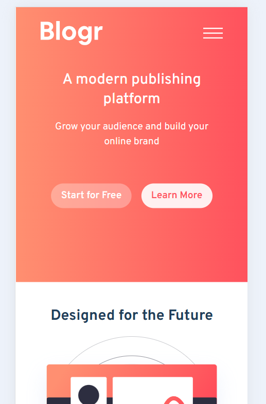

# Blogr Landing Page Website Laura Dev

This project involved working on a solo project Blogr landing page with Typescript and TailwindCSS. 

## Table of contents

- [Overview](#overview)
  - [Screenshots](#screenshots)
  - [Links](#links)
- [My process](#my-process)
  - [Built with](#built-with)
  - [What I learned](#what-i-learned)
  - [Continued development](#continued-development)
  - [Useful resources](#useful-resources)
- [Author](#author)

## Overview

Challenge: "Flex your layout muscles with this landing page challenge. You'll mostly be working with HTML & CSS for this project with a tiny bit of JS for the mobile menu."

Your users should be able to:

- View the optimal layout for the site depending on their device's screen size
- See hover states for all interactive elements on the page

## Screenshots

Desktop Version:

Desktop Version Body Component:

Desktop Version Footer Component:

Mobile Version Landing Page:

Mobile Version Side Navigation Bar:

## Links

- Live Site URL: [Blogr Landing Page Website Laura Dev](https://blogr-landingpage-lauradev.netlify.app/)

## My Process

I began my process on the Blogr Landing Page by reviewing the design materials and downloading the necessary files. From there, I was able to create a Github repo, install TypeScript, and TailwindCSS. I was able to use a template for my README that I copied over to this particular project. I added the design files style guide recommended colors and fonts in the Tailwind config file. To complete the beginning phase of setting up the project, I added the assets to the asset folder and images.

To begin my project, I started my reviewing the index html file by updating the title and icon in the website tab. From there, I worked on creating the components I would use to create the website. I structured the layout in a way that there was a Header, Body and Footer. The Header was the most complex in that I used that component to import reusable commponents and mobile vs desktop versions. After determining the structure of the website, I started by adding content into each section as a way to review the changes as I completed them. 

The navigation bar and side navigation bar was the most challenging of the project as it required more understanding of interactive pieces on the website. I was able to create a general navigation bar for the desktop version using a dropdown functionality. Additionally, I added the sign up and login buttons that have hover state functionality for the end user. I worked my way down the design file page by creating the main page content and buttons. Then I started on the body component creating three separate distinct components for the body based on section. After all the sections had a general design and content added, I started again from the top of the website to refine the pages with specific details such as color gradient, image resizing, and mobile version responsiveness.

I went through the website and added the specific functionalities requested in the design file. I fine tuned the hover states for the buttons. I worked on reformatting the navigation bar and footer with padding and margins. I worked on the side navigation bar for mobile responsiveness. Once I felt complete with the desktop version, I went through and added sizing parameters for some of the TailwindCSS styling components to make it mobile responsiveness. I added the additional images that were mobile specific and swapped them out at the mobile breakpoints. Furthermore, I went throught the content and text to update to the specific Google Font requests and font weight sizes for each section. I was able to debug most of the issues with some design requests I was unable to finish.

The final touches involved updating the README file, creating a Netlify website, and reviewing the final design.

## Built with

- Typescript
- TailwindCSS
- ReactJS
- Google Fonts
- Github

## What I learned

I reinforced and learned a lot of new things during this project. Some of things that were more relevant:

1. **_Typescript Programming Language_** - The goal of TypeScript is to be a static typechecker for JavaScript programs - in other words, a tool that runs before your code runs (static) and ensures that the types of the program are correct (typechecked).
2. **_TailwindCSS Config File_** - I began by updating the style guide in the TailwindCSS file. I found that I was receiving errors - I learned that you must keep the hsl formatting and also include it in a colors section. I had to define them in the extend object.
3. **_React Recent Versions_** - I learned that you don't need to import React at the beginning of the file when the React version is more recent.
4.**_Gradient Colors_** - I added a gradient to some of the backgrounds of each component and found to use the TailwindCSS gradient feature to be useful.

## Continued development

I will continue to learn more about Typescript and work on more advanced projects. Additionally, I want to continue to update this website with new features and options.

Some things I would like to update on this website:
1. Add curved design sections on some of the colored sections
2. Fix the sizing of the images in regards to the design files
3. Fix the Dropdown menu to include more options for each individual section in desktop mode

## Useful resources

- [TypeScript](https://www.typescriptlang.org/) - Typescript General Website

- Family: [Overpass](https://fonts.google.com/specimen/Overpass?preview.text_type=custom) Weights: 300, 600

- Family: [Ubuntu](https://fonts.google.com/specimen/Ubuntu?preview.text_type=custom) Weights: 400, 500, 700

- [Dropdown Menus TailwindCSS](https://tailwindui.com/components/application-ui/elements/dropdowns#component-f8a14da22f26a67757b19f2fe3ca00ed)

- [TailwindCSS Background Gradient](https://tailwindcss.com/docs/background-image)

## Author

- Website - [Laura V](www.lauradeveloper.com)
- Frontend Mentor - [@lavollmer](https://www.frontendmentor.io/profile/lavollmer)
- Github - [@lavollmer](https://github.com/lavollmer)